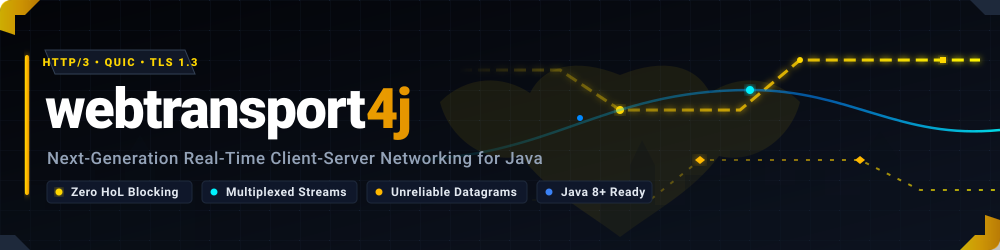
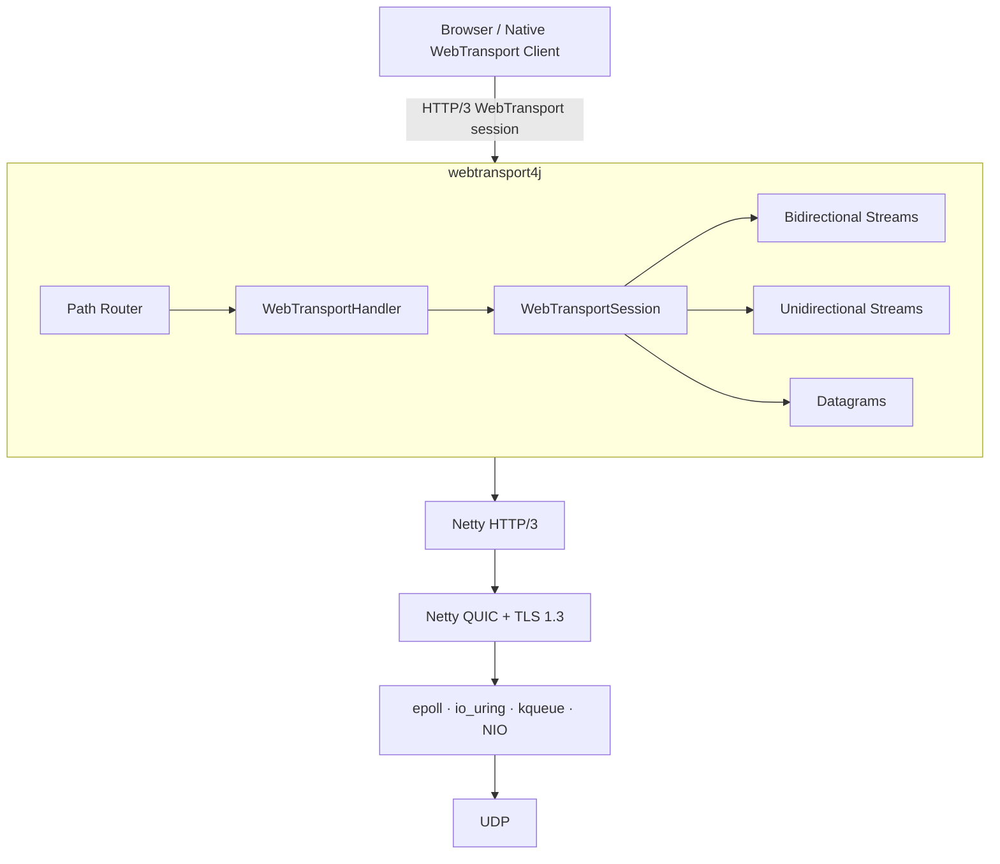
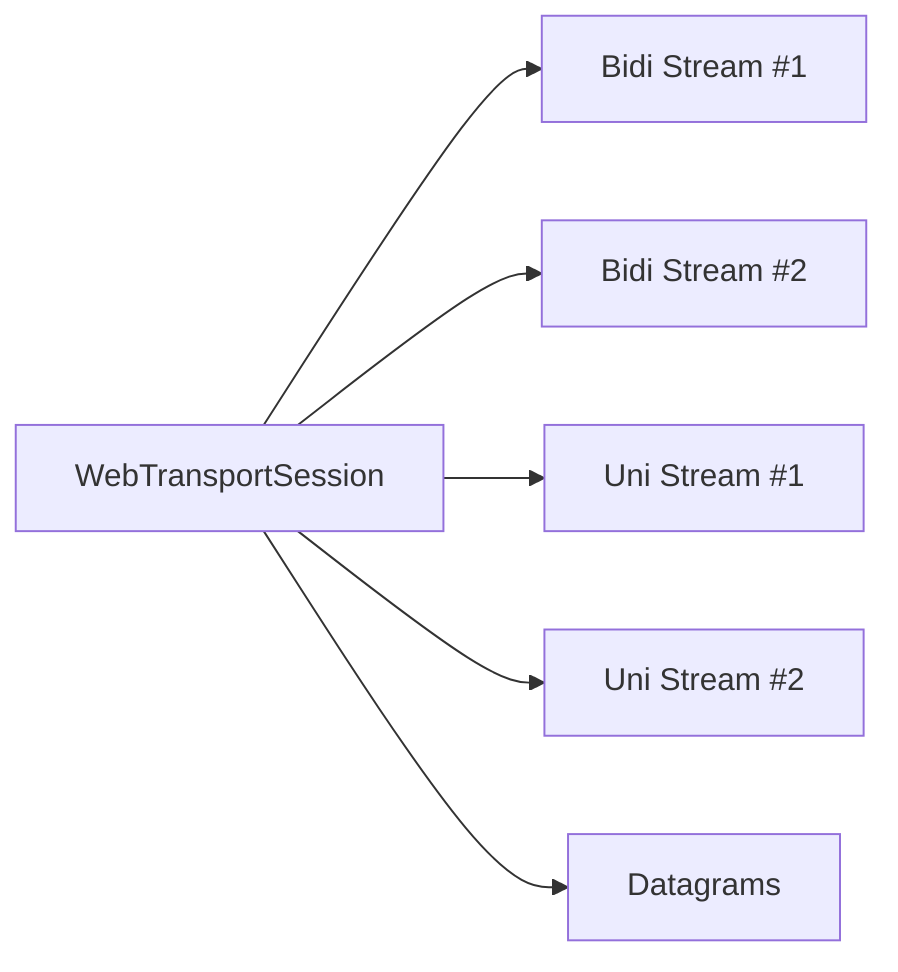
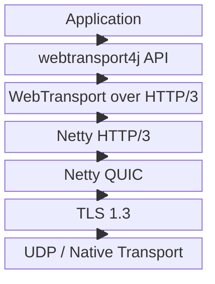
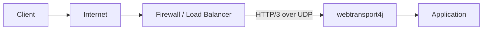

<p align="center">
  
</p>

<h1 align="center">
  webtransport<span style="color:#7C3AED;">4j</span>
</h1>

<p align="center">
  <strong>WebTransport over HTTP/3 for Java, built on Netty and QUIC.</strong>
</p>

<p align="center">
  Bidirectional streams · Unidirectional streams · Datagrams · Async APIs · Reactive Streams
</p>

<p align="center">
  <a href="https://datatracker.ietf.org/doc/draft-ietf-webtrans-http3/">
    
  </a>
  <a href="https://netty.io/">
    
  </a>
  
  
  <a href="LICENSE">
    
  </a>
  <a href="https://deepwiki.com/webtransport4j/webtransport4j"></a>
</p>

<p align="center">
  <a href="#quick-start">Quick Start</a>
  ·
  <a href="API_GUIDE.md">API Guide</a>
  ·
  <a href="#architecture">Architecture</a>
  ·
  <a href="#interoperability">Interoperability</a>
  ·
  <a href="#benchmarking">Benchmarks</a>
  ·
  <a href="#project-status">Project Status</a>
</p>

## Sponsors

<p align="left">
  <kbd>
    <a href="https://stau.ai">
      
    </a>
  </kbd>
</p>

<p align="left">
  <sub>Sponsored by <a href="https://stau.ai"><strong>STAU.AI</strong></a></sub>
</p>

---

**webtransport4j** is a WebTransport server implementation for the JVM.

It exposes WebTransport sessions, QUIC streams, and datagrams through a Java API while using **Netty HTTP/3 and QUIC** for the underlying transport.

WebTransport is useful when a single ordered TCP stream is not enough: applications can use multiple independent reliable streams alongside unreliable datagrams, all within the same secure HTTP/3 connection.

```text
WebTransport API
      │
      ├── Bidirectional Streams
      ├── Unidirectional Streams
      └── Datagrams
      │
    HTTP/3
      │
     QUIC
      │
   TLS 1.3
      │
     UDP
```

## At a glance

|                           |                                                            |
| ------------------------- | ---------------------------------------------------------- |
| **Protocol**              | WebTransport over HTTP/3                                   |
| **Network stack**         | Netty HTTP/3 + QUIC                                        |
| **Reliable transport**    | Bidirectional and unidirectional QUIC streams              |
| **Unreliable transport**  | QUIC datagrams                                             |
| **Programming model**     | Callbacks, `CompletableFuture`, Reactive Streams           |
| **Routing**               | Path-based WebTransport endpoints                          |
| **Native transports**     | `epoll`, `io_uring`, `kqueue`, NIO                         |
| **Framework integration** | Standalone Java, Spring Boot, Quarkus integration patterns |
| **License**               | Apache License 2.0                                         |

---

## Why WebTransport?

WebSocket gives an application one reliable and ordered data channel.

WebTransport exposes QUIC more directly. A single session can contain independent streams and unreliable datagrams, allowing an application to choose the appropriate delivery semantics for each type of traffic.

|                              |     WebSocket     |   WebTransport   |
| ---------------------------- | :---------------: | :--------------: |
| Transport                    |        TCP        |       QUIC       |
| Reliable ordered data        |         ✓         |         ✓        |
| Multiple independent streams |         —         |         ✓        |
| Unidirectional streams       |         —         |         ✓        |
| Unreliable datagrams         |         —         |         ✓        |
| Stream-level loss isolation  |         —         |         ✓        |
| Multiplexing                 | Application-level |  Transport-level |
| Encryption                   |        TLS        | TLS 1.3 via QUIC |

For applications carrying different classes of real-time traffic, that distinction matters.

A slow or loss-affected reliable stream does not have to stop unrelated QUIC streams, while latency-sensitive data can be sent as datagrams without retransmission.

---

## Architecture



The application works with WebTransport concepts rather than HTTP/3 framing directly.

`WebTransportSession` represents a session. Each session can receive or create streams and exchange datagrams independently.

---

## Core capabilities

<table>
<tr>
<td width="33%" valign="top">

### Multiplexed streams

Create independent bidirectional and unidirectional streams within the same WebTransport session.

</td>
<td width="33%" valign="top">

### Datagrams

Send messages where low latency is more important than reliable retransmission or ordering.

</td>
<td width="33%" valign="top">

### Asynchronous API

Operations such as stream creation and writes integrate with Java's `CompletableFuture`.

</td>
</tr>

<tr>
<td width="33%" valign="top">

### Path routing

Host multiple WebTransport application endpoints on the same server.

</td>
<td width="33%" valign="top">

### Native transports

Use Netty's `epoll`, `io_uring`, or `kqueue` transports where available, with NIO fallback.

</td>
<td width="33%" valign="top">

### Framework integration

Use webtransport4j directly or integrate it with Spring Boot and reactive application stacks.

</td>
</tr>
</table>

---

## Quick start

### 1. Build

webtransport4j is currently pre-1.0 and does not yet have a stable published release.

Clone and install the current development version:

```bash
git clone https://github.com/webtransport4j/webtransport4j.git
cd webtransport4j

mvn clean install
```

Current coordinates:

```xml
<dependency>
    <groupId>io.github.webtransport4j</groupId>
    <artifactId>webtransport4j</artifactId>
    <version>0.1.0-SNAPSHOT</version>
</dependency>
```

> [!NOTE]
> The core source set targets Java 8-compatible bytecode. The repository also contains Java 25-specific multi-release JAR sources, so use JDK 25 for a complete build of the current repository.

### 2. Start a server

```java
import io.github.webtransport4j.api.WebTransportBuffer;
import io.github.webtransport4j.api.WebTransportHandler;
import io.github.webtransport4j.api.WebTransportSession;
import io.github.webtransport4j.api.WebTransportStream;
import io.github.webtransport4j.server.WebTransportServer;

public final class EchoServer {

    public static void main(String[] args) throws Exception {

        WebTransportServer server = WebTransportServer.builder()
            .port(4433)
            .ssl("localhost-key.pem", "localhost.pem")
            .allowedOrigins("https://localhost:8443")
            .handler("/echo", new WebTransportHandler() {

                @Override
                public void onSessionReady(WebTransportSession session) {
                    System.out.println(
                        "Session established: " +
                        session.getSessionStreamId()
                    );
                }

                @Override
                public void onIncomingStream(
                    WebTransportSession session,
                    WebTransportStream stream) {

                    stream.onData(buffer -> {
                        byte[] data =
                            new byte[buffer.readableBytes()];

                        buffer.readBytes(data);

                        if (stream.isBidirectional()) {
                            stream.write(data);
                        }
                    });
                }

                @Override
                public void onDatagramReceived(
                    WebTransportSession session,
                    WebTransportBuffer buffer) {

                    byte[] data =
                        new byte[buffer.readableBytes()];

                    buffer.readBytes(data);

                    session.sendDatagram(data);
                }
            })
            .build();

        server.startAndAwait();
    }
}
```

### 3. Connect from a browser

```javascript
const transport =
    new WebTransport("https://localhost:4433/echo");

await transport.ready;

console.log("connected");
```

Create a bidirectional stream:

```javascript
const stream =
    await transport.createBidirectionalStream();

const writer = stream.writable.getWriter();
const reader = stream.readable.getReader();

await writer.write(
    new TextEncoder().encode("hello")
);

const { value } = await reader.read();

console.log(
    new TextDecoder().decode(value)
);
```

Send a datagram:

```javascript
const writer =
    transport.datagrams.writable.getWriter();

await writer.write(
    new TextEncoder().encode("position:42,17")
);
```

---

## Programming model

### Sessions

A `WebTransportSession` represents an established WebTransport session.

```java
session.createBiStream();
session.createUniStream();
session.sendDatagram(data);
```

A single session can contain multiple independent streams.



### Asynchronous operations

Public asynchronous operations integrate with `CompletableFuture`.

```java
session.createBiStream()
    .thenCompose(stream ->
        stream.writeText("hello from server"))
    .exceptionally(cause -> {
        cause.printStackTrace();
        return null;
    });
```

No framework-specific future type is required by the core API.

### Incoming streams

```java
@Override
public void onIncomingStream(
    WebTransportSession session,
    WebTransportStream stream) {

    stream.onData(buffer -> {
        System.out.println(
            "received " +
            buffer.readableBytes() +
            " bytes"
        );
    });
}
```

### Datagrams

```java
@Override
public void onDatagramReceived(
    WebTransportSession session,
    WebTransportBuffer data) {

    System.out.println(
        "datagram: " +
        data.readableBytes() +
        " bytes"
    );
}
```

---

## Path-based endpoints

Different application protocols can be exposed through different paths.

```java
WebTransportServer server =
    WebTransportServer.builder()
        .port(4433)
        .ssl("server-key.pem", "server-cert.pem")
        .handler("/chat", chatHandler)
        .handler("/telemetry", telemetryHandler)
        .handler("/events", eventHandler)
        .build();
```

```text
https://example.com/chat
                    └── ChatHandler

https://example.com/telemetry
                    └── TelemetryHandler

https://example.com/events
                    └── EventsHandler
```

A default handler can also be registered for unmatched routes:

```java
.defaultHandler(defaultHandler)
```

---

## Server configuration

The server builder exposes the primary transport and resource controls:

```java
WebTransportServer server =
    WebTransportServer.builder()
        .host("0.0.0.0")
        .port(4433)
        .ssl(
            "server-key.pem",
            "server-cert.pem"
        )
        .allowedOrigins(
            "https://example.com"
        )
        .transportType("auto")
        .idleTimeout(
            60,
            TimeUnit.SECONDS
        )
        .maxStreams(
            500,
            500
        )
        .maxData(
            16 * 1024 * 1024
        )
        .handler(
            "/transport",
            handler
        )
        .build();
```

### Transport selection

```text
              auto
                │
        ┌───────┼────────┐
        │       │        │
      Linux   macOS    Fallback
        │       │        │
   epoll /   kqueue     NIO
   io_uring
```

Supported transport values:

| Value     | Transport                                   |
| --------- | ------------------------------------------- |
| `auto`    | Automatically select an available transport |
| `epoll`   | Linux native epoll                          |
| `iouring` | Linux native io_uring                       |
| `kqueue`  | macOS/BSD native kqueue                     |
| `nio`     | Java NIO                                    |

---

## Reactive Streams

webtransport4j also exposes a Reactive Streams programming model.

```java
WebTransportServer server =
    WebTransportServer.builder()
        .port(4433)
        .ssl(
            "server-key.pem",
            "server-cert.pem"
        )
        .reactiveHandler(
            "/events",
            eventHandler
        )
        .build();
```

This allows WebTransport events to participate in existing reactive pipelines without changing the underlying transport model.

See **[API_GUIDE.md](API_GUIDE.md)** for the complete reactive API.

---

## Spring Boot

webtransport4j includes Spring Boot integration for application lifecycle management and declarative endpoints.

```properties
webtransport4j.port=4433

webtransport4j.ssl-key-path=/etc/webtransport/key.pem
webtransport4j.ssl-cert-path=/etc/webtransport/cert.pem

webtransport4j.allowed-origins=https://example.com

webtransport4j.transport=auto

webtransport4j.idle-timeout-seconds=60

webtransport4j.max-streams-bidi=500
webtransport4j.max-streams-uni=500
```

Endpoints can be registered declaratively:

```java
@WebTransportEndpoint(path = "/events")
@Component
public final class EventsEndpoint
        implements WebTransportHandler {

    @Override
    public void onSessionReady(
        WebTransportSession session) {

        // Session is ready.
    }
}
```

See **[API_GUIDE.md](API_GUIDE.md)** for complete Spring Boot examples.

---

## Interoperability

A transport implementation should be tested against independent implementations rather than only against itself.

The repository includes interoperability tooling under [`interop/`](interop/).

```text
interop/
├── README.md                      # Detailed interop documentation
├── run_tests.sh                   # Unified interop test runner
├── python/                        # Python Draft-16 test suite & clients
│   ├── interop_test_suite.py      # Full 30-test Draft-16 matrix
│   ├── benchmarks/                # Performance benchmarks
│   ├── examples/                  # Real-world chat and voice demos
│   └── diagnostics/               # Diagnostic & stream probe scripts
├── go/                            # Go client & throughput benchmarks
│   ├── client.go
│   └── throughput/
└── browser/                       # Browser WebTransport test console
    └── native-wt-test.html
```

Current interoperability coverage includes:

| Capability                             | Coverage |
| -------------------------------------- | :------: |
| Session establishment                  |     ✓    |
| Client → server bidirectional streams  |     ✓    |
| Client → server unidirectional streams |     ✓    |
| Server → client bidirectional streams  |     ✓    |
| Server → client unidirectional streams |     ✓    |
| Datagrams                              |     ✓    |
| Concurrent streams                     |     ✓    |
| Large payload integrity                |     ✓    |
| Stream-limit / flow-control behavior   |     ✓    |
| Idle connection behavior               |     ✓    |
| Independent stream behavior            |     ✓    |
| Browser API testing                    |     ✓    |
| Go implementation testing              |     ✓    |
| Python implementation testing          |     ✓    |

The Go interoperability client uses **webtransport-go / quic-go**, while the Python suite exercises the server using an independent Python WebTransport implementation.

---

## Local browser testing

WebTransport requires a secure context.

For local development, [`mkcert`](https://github.com/FiloSottile/mkcert) provides a convenient way to create a locally trusted certificate.

### Generate a localhost certificate

```bash
brew install mkcert
mkcert -install

mkcert \
  -key-file localhost-key.pem \
  -cert-file localhost.pem \
  localhost 127.0.0.1 ::1
```

Start webtransport4j using:

```java
WebTransportServer.builder()
    .port(4433)
    .ssl(
        "localhost-key.pem",
        "localhost.pem"
    )
    .handler(
        "/test",
        handler
    )
    .build();
```

Serve the browser interoperability page over HTTPS:

```bash
npx http-server interop \
    -S \
    -C localhost.pem \
    -K localhost-key.pem \
    -p 8443
```

Open:

```text
https://localhost:8443/native-wt-test.html
```

### Firefox

When using Firefox for local WebTransport testing, import the `mkcert` root CA into Firefox if it is not already trusted by the browser.

Open:

```text
Settings
  → Privacy & Security
  → Certificates
  → View Certificates
  → Authorities
```

Import the root CA generated by `mkcert`.

You can locate it with:

```bash
mkcert -CAROOT
```

For local HTTP/3 testing, the following preferences may also be required.

Open:

```text
about:config
```

and verify:

```text
network.http.http3.disable_when_third_party_roots_found = false
network.http.http3.enable_localhost = true
network.http.http3.enabled = true
```

> [!NOTE]
> Firefox behavior and HTTP/3 development preferences may change between browser versions. These settings are intended for local development and troubleshooting.

---

## Protocol stack

webtransport4j builds on Netty's HTTP/3 and QUIC implementations rather than reimplementing the underlying network stack.



Relevant standards:

* [WebTransport over HTTP/3](https://datatracker.ietf.org/doc/draft-ietf-webtrans-http3/)
* [WebTransport Protocol Framework](https://datatracker.ietf.org/doc/draft-ietf-webtrans-overview/)
* [HTTP/3 — RFC 9114](https://www.rfc-editor.org/rfc/rfc9114)
* [QUIC — RFC 9000](https://www.rfc-editor.org/rfc/rfc9000)
* [Using TLS to Secure QUIC — RFC 9001](https://www.rfc-editor.org/rfc/rfc9001)

---

## Project status

> [!IMPORTANT]
> **webtransport4j is currently pre-1.0.**
>
> The implementation is available for development, interoperability testing, experimentation, and early integration. API compatibility is not yet guaranteed between development releases.

The WebTransport over HTTP/3 specification is still progressing through the IETF standardization process.

```text
WebTransport draft
        │
        ▼
IETF WebTransport WG
        │
        ▼
      IESG
        │
        ▼
       RFC
        │
        ▼
 webtransport4j 1.0
```

The core WebTransport transport model is already implemented. Development toward 1.0 is focused primarily on specification alignment, interoperability, validation, benchmarking, documentation, and API stabilization.

### Road to 1.0

```text
 Core session support                  DONE
 Bidirectional streams                DONE
 Unidirectional streams               DONE
 Datagrams                            DONE
 Client-initiated streams             DONE
 Server-initiated streams             DONE
 Browser interoperability             DONE
 Cross-implementation testing         DONE
 Reactive API                         DONE
 Spring integration                   DONE

 Extended interoperability             ↻
 Extended performance benchmarking     ↻
 Final RFC alignment                   WAITING ON IETF
 Public API stability review           ↻
 Production documentation              ↻

 1.0.0                                 AFTER RFC ALIGNMENT
```

---

## Benchmarking

The repository contains both JVM microbenchmark infrastructure and end-to-end throughput tooling.

### JMH

```bash
mvn test -Pbench
```

### Interoperability / throughput

Additional tooling lives under:

```text
interop/go/throughput/
```

Performance numbers should always be published together with enough information to reproduce them:

```text
Hardware
CPU allocation
Memory
Operating system
Kernel
JDK version
GC
Netty version
Native transport
Payload size
Stream count
Connection count
Network conditions
```

For that reason, webtransport4j avoids unqualified throughput or latency claims in this README.

A broader benchmark suite is planned as part of the work leading to the 1.0 release.

---

## Production deployment

> [!WARNING]
> WebTransport uses HTTP/3 over QUIC and therefore requires **UDP connectivity** between clients and the server. Infrastructure that only forwards TCP traffic is not sufficient.



Before production deployment, validate:

* UDP reachability
* HTTP/3 and WebTransport support through proxies and load balancers
* TLS certificate management
* operating-system file-descriptor limits
* UDP receive and send buffer limits
* QUIC connection limits
* stream limits
* idle timeouts
* application backpressure
* memory limits
* metrics and observability
* graceful shutdown behavior

### TLS certificate configuration

> [!WARNING]
> **Do not use hardcoded developer certificate paths or locally generated self-signed certificates in production.**
>
> Use certificates issued for the deployment environment and provide their locations through application configuration, environment variables, secrets management, or JVM properties.

For example:

```bash
-Dwebtransport4j.ssl.cert.path=/etc/letsencrypt/live/yourdomain.com/fullchain.pem
-Dwebtransport4j.ssl.key.path=/etc/letsencrypt/live/yourdomain.com/privkey.pem
```

Private keys should not be committed to source control.

### Linux file descriptors and UDP buffers

High-concurrency QUIC servers can be constrained by operating-system defaults.

For workloads involving a large number of concurrent sessions, review both the process file-descriptor limit and Linux UDP socket-buffer limits.

An example high-concurrency baseline is:

```bash
# Increase process file-descriptor limit
ulimit -n 1048576
```

Example Linux UDP buffer settings:

```bash
sudo sysctl -w net.core.rmem_max=16777216
sudo sysctl -w net.core.wmem_max=16777216

sudo sysctl -w net.core.rmem_default=8388608
sudo sysctl -w net.core.wmem_default=8388608
```

These values correspond to:

```text
Maximum receive buffer      16 MiB
Maximum send buffer         16 MiB
Default receive buffer       8 MiB
Default send buffer          8 MiB
```

> [!IMPORTANT]
> These values are examples, not universal requirements.
>
> Appropriate limits depend on connection count, traffic pattern, payload size, host memory, kernel version, network interface, and deployment architecture. Benchmark the actual workload and tune accordingly.

For persistent configuration, use the operating system's standard `sysctl` configuration mechanism rather than relying only on runtime commands.

---

## Security

QUIC uses TLS 1.3 as part of the protocol.

For production deployments:

* use certificates issued for the deployment environment;
* keep private keys outside source control;
* configure trusted WebTransport origins;
* expose only the required UDP ports;
* terminate QUIC only at infrastructure that explicitly supports HTTP/3 and WebTransport;
* apply application authentication and authorization at the WebTransport endpoint.

Developer certificates generated for localhost must not be used in production.

---

## Documentation

<table>
<tr>
<td width="50%" valign="top">

### API Guide

Core API, streams, sessions, datagrams, asynchronous programming, and integration examples.

**[Read API_GUIDE.md →](API_GUIDE.md)**

</td>
<td width="50%" valign="top">

### Interoperability

Browser, Python, and Go clients plus stream, datagram, and transport test tooling.

**[Browse interop/ →](interop/)**

</td>
</tr>
</table>

---

## Building the project

The repository uses Maven.

```bash
git clone https://github.com/webtransport4j/webtransport4j.git
cd webtransport4j

mvn clean verify
```

Run the benchmark profile:

```bash
mvn test -Pbench
```

### Java layout

webtransport4j is built as a multi-release JAR.

```text
src/main/java/
    └── Java 8 baseline implementation

src/main/java-25/
    └── Java 25-specific implementation

META-INF/versions/25/
    └── Java 25 classes in packaged MR-JAR
```

This allows the project to maintain a broad baseline while taking advantage of newer JVM capabilities where an implementation specifically provides them.

---

## Contributing

Protocol implementations benefit particularly from independent interoperability testing.

Useful contributions include:

* protocol interoperability reports;
* browser compatibility findings;
* failing test cases;
* QUIC or HTTP/3 edge cases;
* performance profiles;
* memory and allocation profiles;
* documentation corrections;
* implementation improvements.

When filing a protocol-related issue, include:

```text
webtransport4j commit/version
JDK version
OS and architecture
client implementation
client/browser version
transport in use
reproduction steps
relevant logs
```

Pull requests that change protocol behavior should include tests where practical.

---

## Protocol development

WebTransport itself is still being standardized by the IETF WebTransport Working Group.

webtransport4j tracks that work so that protocol changes can be incorporated as the specification progresses toward RFC publication.

**[WebTransport over HTTP/3 — IETF Datatracker](https://datatracker.ietf.org/doc/draft-ietf-webtrans-http3/)**

---

## License

Licensed under the **Apache License, Version 2.0**.

See [LICENSE](LICENSE) for the full license text.

---

<p align="center">
  <strong>webtransport4j</strong><br>
  WebTransport · HTTP/3 · QUIC · Java
</p>

<p align="center">
  <a href="API_GUIDE.md">Documentation</a>
  ·
  <a href="interop/">Interop</a>
  ·
  <a href="https://github.com/webtransport4j/webtransport4j/issues">Issues</a>
  ·
  <a href="https://datatracker.ietf.org/doc/draft-ietf-webtrans-http3/">Specification</a>
</p>
